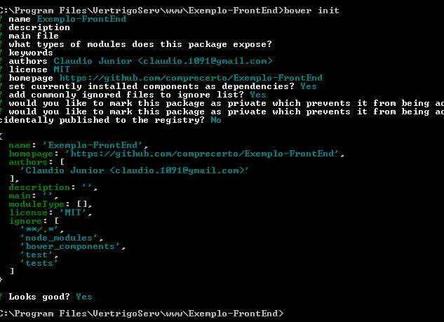

# Exemplo-FrontEnd
Projeto de Exemplo Front End do SigPharma

## Instalação do Bower
A instalação do **Bower** exije que primeiramente seja feita a instalação do **NodeJS** na máquina.

#### Instale na seguinte ordem:
* [**NodeJS**](https://nodejs.org/en/);
* [**Bower**](http://bower.io/#install-bower) (execute as instruções fornecidas no site no *prompt de comando*);

## Inicialização do Projeto
Crie a estutura de pastas básica para inicio do projeto, no *Ex.: Exemplo-FrontEnd*

	Exemplo-FrontEnd
	| assets
	---	| css
	---	| images
	---	| js
	| controllers
	| directives
	| services
	| templates
	| views
	| app.js
	| app.router.js
	| index.html

Após a estrutura base do projeto, inicie o bower na pasta raiz (segurando *shift*, clique na raiz do projeto com o botão direito do *mouse* e selecione *Abrir janela de comando aqui*).

Digite:

	bower init

Informe as informações que lhe forem pedidas. Ao final terá algo quase igual a isto:

Além de criar um novo arquivo na estrutura: *bower.json*

## Instalação de Packages Bower

Para instalar novos *packages* no bower há duas maneiras:
* Através do arquivo *bower.json* - *(através do arquivo, é necessário aplicar as alterações via prompt de comando)*
* Através do *prompt de comando*

#### Via prompt de comando

Inicie o prompt a pasta do *bower.json* e execute o comando:

	bower install <biblioteca><versão> <--save ou --save-dev>

Em versão informe:

	#1.1.1 - exatamente a versão 1.1.1 da biblioteca
	#~1.1.1 - a partir da versão 1.1.1 ou mais nova da biblioteca
	não informe nada para pegar sempre a ultima versão da biblioteca

Ex.: para instalar o JQuery

	bower install jquery#~1.11.* --save

